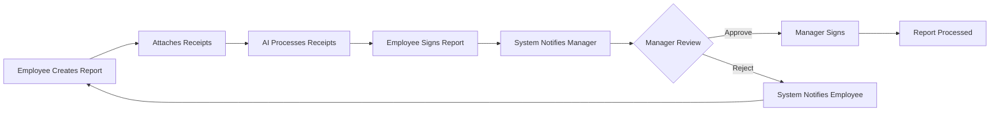

# 📊 Abra Expense Report System


A modern, responsive web application for managing employee expense reports with automated receipt processing, digital signatures, and a streamlined approval workflow.

](https://media.licdn.com/dms/image/v2/C4D0BAQH8RXrIA-H-Wg/company-logo_200_200/company-logo_200_200/0/1659272782073?e=2147483647&v=beta&t=c59UA2Jwtt5lgjHuNuYL_dwa2UI86qTVuh7Ix-aFD4I))

## 🌟 Features

- 💼 **Complete Expense Management**: Track different expense types including fuel, travel, parking, mileage, and more
- 🧠 **AI-Powered Receipt Processing**: Automatic data extraction from receipts using Gemini API
- ✍️ **Digital Signatures**: Built-in signature pad for employee and manager approvals
- 📱 **Fully Responsive Design**: Works seamlessly on desktop, tablet, and mobile devices
- 🌓 **Light/Dark Theme**: User-selectable color scheme to improve accessibility
- 🔄 **Real-time Validation**: Immediate feedback on form inputs
- 📑 **PDF Support**: View and upload PDF receipts directly in the application
- 🔄 **Drag and Drop Interface**: Easy file uploads with preview capability
- 🌐 **RTL Support**: Full right-to-left layout for Hebrew language
- 📊 **Visual Feedback**: Real-time expense totals and category breakdowns

## 🚀 Technologies Used

- **Frontend**:
  - HTML5, CSS3 (with responsive design)
  - JavaScript (ES6+)
  - Bootstrap 5 (RTL support)
  - Tailwind CSS (utilities)
  - SweetAlert2 for notifications
  - SignaturePad.js for digital signatures
  - Luxon for date handling
  - Lucide for iconography
  - PDF.js for PDF rendering

- **APIs/Backend Integration**:
  - Azure Logic Apps for backend processing
  - Google Gemini API for receipt OCR and data extraction
  - Microsoft Clarity for analytics

## 📋 Requirements

- Modern web browser with JavaScript enabled
- Backend API endpoint for data storage (Azure Logic Apps)
- Gemini API key for receipt processing
- Internet connection for CDN resources

## 🛠️ Installation

1. Clone the repository:
   ```bash
   git clone https://github.com/abratech/expense-report.git
   cd expense-report
   ```

2. Configure your API endpoints:
   - Update the `API_ENDPOINT` constant in the JavaScript code
   - Set your Gemini API key in the `GEMINI_API_KEY` constant

3. Test locally with a server:
   ```bash
   npx serve
   ```

4. Deploy to your web server or hosting service

## 📝 Usage

### For Employees:

1. Fill in your details (email, manager email)
2. Add expenses using the quick-add buttons
3. Enter expense details and attach receipts (drag & drop supported)
4. Review the expense summary
5. Sign the form in the employee signature area
6. Submit the report

### For Managers:

1. Receive the expense report link via email
2. Review the submitted expenses
3. Approve or reject the report with optional comments
4. Sign in the manager signature area when approving

## 📅 Monthly Deadline System

The application includes a smart calendar alert system that highlights:
- 📆 The 25th of each month as the cutoff date for same-month processing
- 🟢 Days (1-25): Expenses will be processed in the current month's payroll
- 🟠 Days (26-31): Expenses will be processed in the next month's payroll

## 🔍 Receipt Processing Flow

1. Upload a receipt image
2. The system automatically extracts:
   - 📅 Date
   - 💰 Total amount
   - 🧾 Invoice/receipt number
3. Fields are auto-populated
4. User can verify and adjust if needed

## 🖋️ Digital Signature System

- Canvas-based signature capture
- Different signature areas for employees and managers
- Responsive design adapts to device size
- Touch-optimized for mobile devices
- Signatures stored as base64 PNG images

## 🔄 System Workflow



## 📱 Mobile Support

The application is fully responsive and optimized for mobile devices with:
- Touch-friendly interfaces
- Optimized signature capture for touch screens
- Smart UI adaptations for smaller screens
- Camera integration for receipt photos

## 👥 Contributing

1. Fork the repository
2. Create a feature branch: `git checkout -b feature/amazing-feature`
3. Commit your changes: `git commit -m 'Add some amazing feature'`
4. Push to the branch: `git push origin feature/amazing-feature`
5. Open a Pull Request

## 🔐 Security Features

- Content Security Policy implementation
- Form validation with XSS protection
- Secure signature and file handling
- Domain-restricted email validation

## 📈 Roadmap

- [ ] Expense report templates for different departments
- [ ] International travel expense handling
- [ ] Integration with accounting software
- [ ] Multi-language support
- [ ] Advanced analytics dashboard
- [ ] Recurring expense templates

## 📞 Support

For help or issues, please contact our support team:
- 📧 Email: support@abra.co.il
- 🌐 Website: https://abra.co.il/support
- 📱 Phone: +972-XX-XXX-XXXX

## 📜 License

This project is licensed under the MIT License - see the [LICENSE.md](LICENSE.md) file for details.

## 🙏 Acknowledgements

- [Bootstrap Team](https://getbootstrap.com/) for the responsive framework
- [SweetAlert2](https://sweetalert2.github.io/) for the enhanced dialog boxes
- [SignaturePad](https://github.com/szimek/signature_pad) for the signature functionality
- [PDF.js](https://mozilla.github.io/pdf.js/) for PDF handling
- [Lucide Icons](https://lucide.dev/) for the beautiful iconography
- [Google Gemini](https://ai.google.dev/products/gemini) for AI-powered receipt processing
